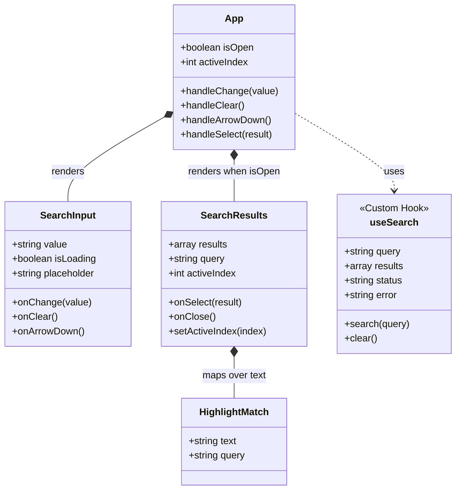
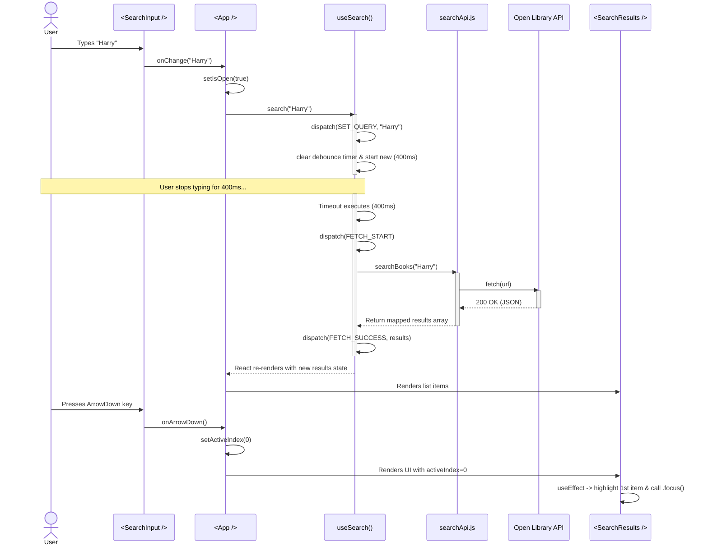

# Books Live Search - Architecture Specification

## 1. High-Level Overview
This project is a React-based "Live Search with Autocomplete" application. It fetches book data from the Open Library API as the user types. The architecture strongly adheres to React best practices by decoupling UI presentation, state management, and side effects. Because React promotes a "one-way data flow" and composition, the application is broken down into smart (stateful) and dumb (presentational) components, tied together with custom React hooks.

## 2. Component Hierarchy & Responsibilities

### `<App />` (The Orchestrator)
The root component serves as the central hub. It maintains the UI state related to the dropdown's visibility (`isOpen`) and the currently keyboard-highlighted item (`activeIndex`). 
- **React Principle:** Lifting State Up. By keeping `isOpen` and `activeIndex` here, `<App />` can control both siblings (`<SearchInput />` and `<SearchResults />`) simultaneously.
- **Refs & Effects:** It uses `useRef` to attach to the main wrapper DOM node and pairs it with a `useEffect` to listen for global `mousedown` events on the document. This is classic React "click outside to close" behavior.

### `<SearchInput />` (Presentation & Capture)
A controlled component responsible purely for rendering the input field, the loading spinner, and the clear button.
- **Controlled Input:** The `<input>` value is strictly bound to the `value` prop overriding local DOM state. Every keystroke triggers `onChange`, sending control back to the parent.
- **DOM Refs:** It uses `useRef` to maintain a reference to the actual DOM `<input>` element to programmatically manage focus (e.g., returning focus `inputRef.current?.focus()` to the text box after the user clicks the "Clear" button), bypassing normal declarative rendering for strict DOM actions.

### `<SearchResults />` (List & Keyboard Navigation)
Responsible for rendering the fetched string payload into interactive DOM elements. It manages complex keyboard navigation (Up, Down, Enter, Escape) when the user moves focus off the input box into the list.
- **Dynamic Refs Array:** It uses an array of `refs` (`itemRefs.current[index]`) to track every dynamically rendered list item (`<li>`). 
- **Synchronizing State to DOM:** A `useEffect` hooks into `activeIndex` changes (driven by keyboard presses passing through). When the index changes, React runs the effect to call the native `.scrollIntoView()` and `.focus()` on the exact list item matching that index.

### `<HighlightMatch />` (Text Processing)
A small, pure UI component that splits titles into segments to wrap the portion that matches the user's query in CSS styling. It relies heavily on typical React list-rendering by returning arrays of `` elements with unique `key` props.

## 3. State Management & Custom Hooks

At the core of the business logic is the `useSearch.js` hook. Extracting complex behavior into a custom hook ensures components remain purely presentational and easier to test.

### The `useSearch` Hook
- **`useReducer` for Complex State:** Instead of multiple distinct `useState` calls (which could lead to impossible asynchronous states like `isLoading: true` but also `status: 'idle'`), it uses `useReducer`. The state transitions through explicit actions (`SET_QUERY`, `FETCH_START`, `FETCH_SUCCESS`, `FETCH_ERROR`, `CLEAR`).
- **Debouncing with `useRef`:** To prevent spamming the API on every single component render or keystroke, a debounce strategy is used. React's `useRef` stores the `setTimeout` timer ID. Since `useRef` persists across renders but **never** triggers a re-render when mutated, it is perfect for tracking background timers. The timer is reset on every keystroke, ensuring the API is only hit 400ms after the user stops typing.
- **`useCallback` for Stable References:** Functions like `search` and `clear` are wrapped in `useCallback`. In React, functions are recreated entirely on every render. `useCallback` memoizes them so their exact memory reference stays perfectly stable across renders. This prevents child components (that receive these functions as props) from needlessly recognizing prop "changes" and re-rendering themselves.
- **`useEffect` Cleanup:** When the component unmounts, any pending network timeouts are cleared `return () => clearTimeout(timer)` in the effect's cleanup function to prevent memory leaks or accidentally calling `dispatch` on a component that no longer exists in the DOM.

## 4. The Network & API Layer (`searchApi.js`)

This module isolates the network request away from the React component lifecycle. It takes a raw string, encodes it, calls the Open Library API utilizing the browser's native `fetch` promise, and shapes the verbose JSON response into a normalized array of objects. Keeping this outside of the React lifecycle means rendering logic doesn't tangle with asynchronous promise chaining.

## 5. Complete Flow of Events (A User Journey)

1. **Typing:** The User presses a key in the `<SearchInput />`. The native `onChange` event fires.
2. **Propagating Up:** The local handler calls the `onChange` callback prop, elevating the raw string up to `<App />`.
3. **Triggering the Flow:** `<App />` receives this string in its `handleChange` function, immediately opening the dropdown (`setIsOpen(true)`). It delegates the string to the `useSearch` hook's `search` method.
4. **State Transition & Debounce:** The `useSearch` hook dispatches a `SET_QUERY` React action to immediately update the controlled input. It then clears any active timeout (via `useRef`) and sets a new 400ms timeout.
5. **Fetching:** 400ms after the final keystroke, the timeout executes. It dispatches `FETCH_START` (forcing a re-render where `<App />` now displays a spinner). The async `searchBooks` function executes.
6. **Resolution:** The promise resolves. `useSearch` dispatches `FETCH_SUCCESS` with the API format. State updates automatically force React to re-render.
7. **Rendering Results:** `<App />` receives the new `results` array constraint and passes it down to `<SearchResults />`, swapping out the spinner markup for mapped list items.
8. **Keyboard Navigation Handoff:** The user presses `ArrowDown` inside the input box. `SearchInput` prevents the defualt page scroll, and triggers `onArrowDown`. `<App />` updates `activeIndex` to `0`. `<SearchResults />` re-renders, sees the active index changed via its `useEffect`, maps `activeIndex` to its stored `itemRefs`, and dynamically applies `.focus()` to the DOM node, seamlessly moving the user from typing to browsing.
